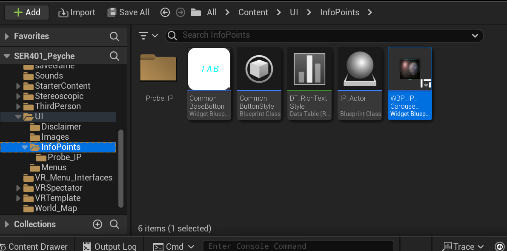
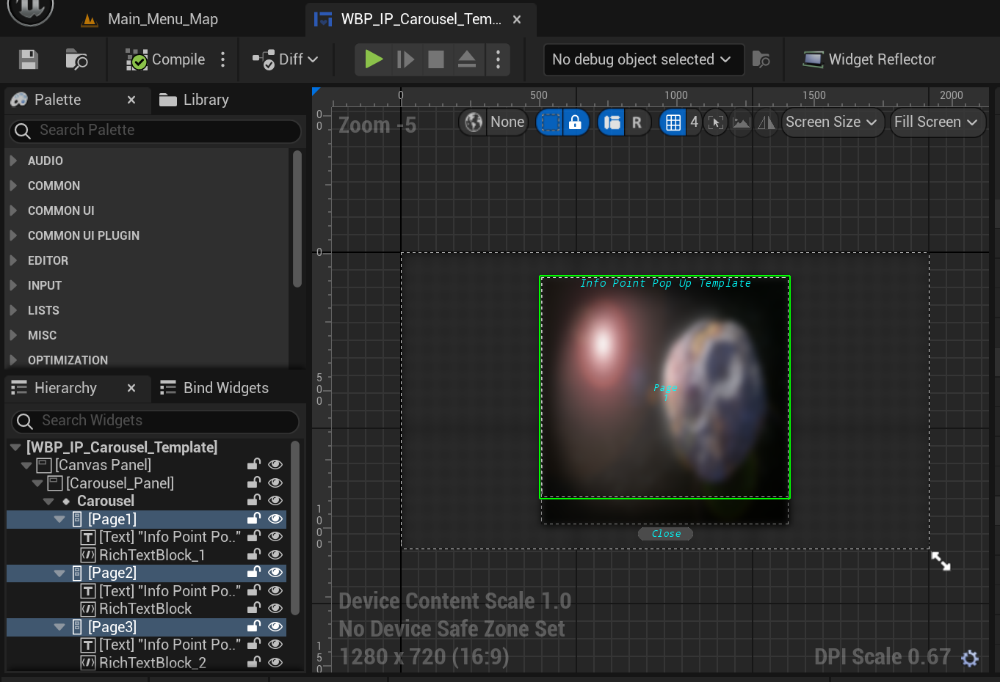
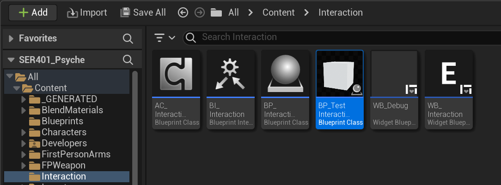
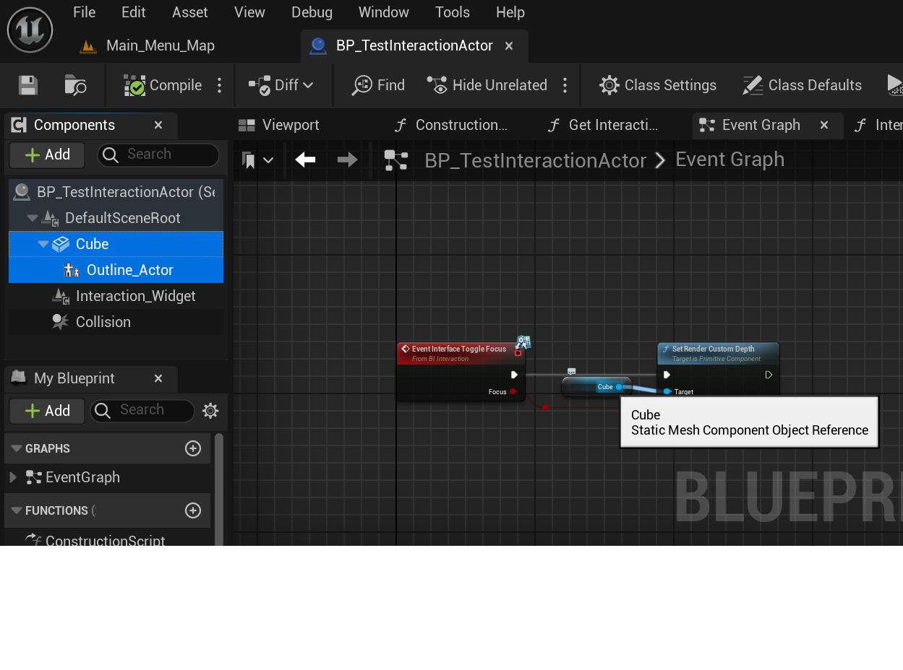
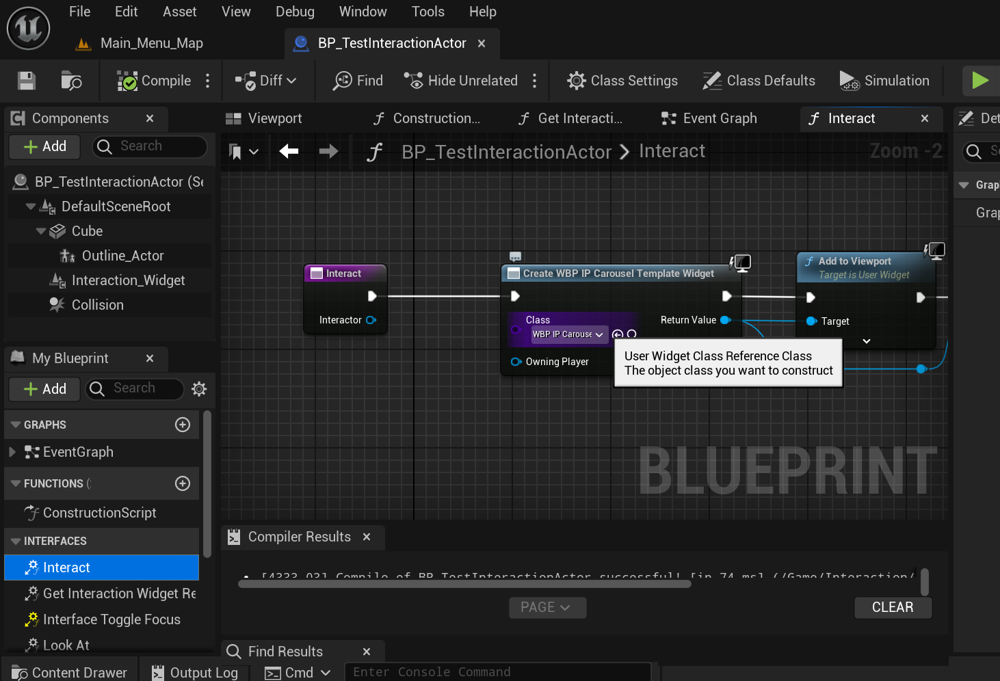

# Educational Info Points as part of the NASA Psyche Mission VR Experience

The Info Points are scattered around the map and are tied to specific objects. When the player approaches an info point object, a highlighted box surrounds the object and an interaction indicator appears above it (initially we are using the letter "E"). When a user interacts with the object by pressing "E", or the vr trigger, (providing they are in range) a widget will appear that they can interact with to learn the information provided. If the object is highlighted, then they are in range and will be able to interact.

- Example(s) to be added later

|||
|--|--|
|Status|In Progress|
|Contributors|Gavin Beaudry, Esaias Glasco, Grant Kelsay, Will Mastronardi, Chris Rogers|
|Last Revision Date| March 19, 2024 |
|Superseded Date| |
|Superseded By| |

## The Zones
### Psyche Zone
Info regarding the composition, location, and improtance of Psyche

### Stereoscopic Zone
What stereoscopic vision is, how it's used in space exploration, and why it's important.

### Satellite Probe Zone
The role of satellite probes as used by NASA, with a particular focus on the one sent to Psyche

### Small Bodies Zone
The diversity of small bodies and their improtance in the solar system.

## Editing and Maintaining within the Program

Follow these steps to create a new Info Point:

- Naming convention: IP_[ZoneName]
- Create a folder in All>Content>UI>InfoPoints named IP_[ZoneName]
- All>Content>UI>InfoPoints>WBP_IP_Carousel_Template
    - Contains the logic for the pop-up widget. Duplicate this widget and move it into the folder you just created. Rename it IP_[ZoneName]Widget
    
    - The info content should be put in Vertical Boxes nested under Carousel.
    
    - You can add/remove pages as long as they are nested under Carousel
- All>Content>Interaction>BP_TestInteractionActor 
    - Contains logic for the interaction. Duplicate this actor and move it to the folder you created above. Rename it IP_[ZoneName]Actor
    
    - Once duplicated, you can update the material component of the actor (default is Cube). Ensure the Outline_Actor is a child of the portion of the material you want highlighted and make sure that portion of the material is connected to the target of Set Render Custom Depth.
    
    - My Blueprint>Interfaces>Interact is called when the player interacts with this actor. 
        - The Class of the second node of this function: Create [widget name] Widget should be updated to the widget created for the info point. 
       
- Place the Actor you just created on the Psyche_Asteroid_Surface Level at your desired location.

