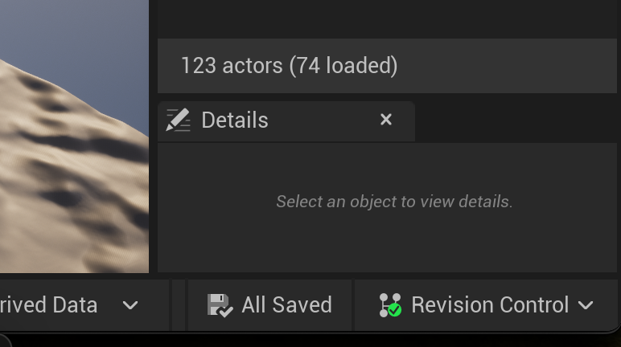

# Setup you workstation for the project

## Clone or fetch the repo 
If the project hasn't bee merged into main, you'll have to fetch the upstream branch that has the project (or most up to date project)
1. clone the repo
2. add any upstream branches
3. checkout the desired branch (dev, etc)

These are the commands I used: 
```
gh repo clone gbeaudry321/ser401-NASA-psyche-mission
cd ser401-NASA-psyche-mission
git remote add upstream https://github.com/gbeaudry321/ser401-NASA-psyche-mission.git
git fetch upstream
git checout --track origin/[branch]
```

## Set up version control
Open the .uproject file. It will launch UnrealEditor. 

On my Mac, there is a Revision Control tab at the bottom right corner of the editor.

Selecting that will give you the option to setup version control. 
Provider: Git (beta version)
Git Path: should be standard, but update if needed.
Accept settings

Use the Revision Control tab to checkout modified files or submit changes. After I submitted changes I still had to push them to the repo using the command line. 

I plan to continue updating this file as I become more familiar with the system, but this link helped a lot: [Unreal Editor Source Control](https://docs.unrealengine.com/4.27/en-US/ProductionPipelines/SourceControl/InEditor/)


***As of 10/11/23 there is a project on the us65 branch called MyProject.uproject. Nothing on Main or Dev***